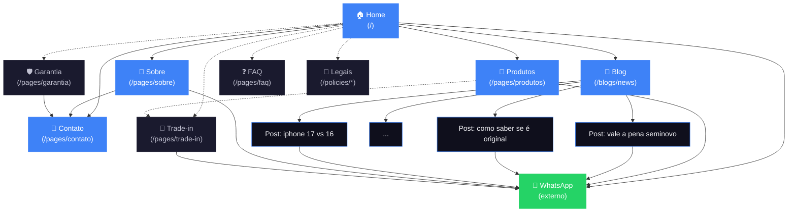

# Arquitetura da informação — Site smartbasebr.com (v1)

**Tipo:** Hybrid SMB — vitrine WhatsApp-funnel + blog/conteúdo + local business
**Objetivos do site** (ordem de prioridade):
1. Iniciar conversa qualificada no WhatsApp
2. SEO local Caxias/Serra Gaúcha (loja física é alavanca)
3. SEO nacional pra keywords de confiança ("iphone seminovo garantia", etc.)
4. Construir autoridade digital em cima da credibilidade offline

**Públicos** (em ordem de prioridade no lançamento):
1. **Profissional autônomo / PJ Serra Gaúcha** (beachhead) — busca local + boca-a-boca digital
2. **Brasileiro buscando iPhone confiável** (expansão M3+) — busca nacional
3. **Cliente seminovo cético** — busca informacional + comparativa

**Decisões herdadas que NÃO mudam:**
- Funil 100% WhatsApp (sem checkout)
- Visual: dark + azul acento + lowercase + Bricolage Grotesque/Inter
- Tom: confiante, direto, sem hype
- Lista de palavras vetadas vale (paralelo, ecossistema, diagnóstico, critério, "leva pra casa")

---

## Inventário de páginas (v1)

Legenda:
- ✓ = já existe
- ★ = existe como âncora na home, **promover a página dedicada**
- 🆕 = página nova

| Página | URL | Status |
|---|---|---|
| Home | `/` | ✓ |
| Produtos | `/pages/produtos` | ✓ |
| Blog | `/blogs/news` | ✓ |
| Post do blog | `/blogs/news/{slug}` | ✓ (template) |
| Sobre | `/pages/sobre` | ★ (hoje é `#sobre` na home) |
| Contato | `/pages/contato` | ★ (hoje é `#contato` na home — uma seção CTA) |
| Trade-in | `/pages/trade-in` | 🆕 |
| Garantia | `/pages/garantia` | 🆕 |
| FAQ | `/pages/faq` | 🆕 |
| 404 | (não tem URL) | ✓ |
| Política de privacidade | `/policies/privacy-policy` | Shopify padrão |
| Termos de uso | `/policies/terms-of-service` | Shopify padrão |

**Por que promover Sobre/Contato a páginas dedicadas:**
- Hoje são âncoras na home. Boas pra UX rápida mas ruins pra SEO (uma URL, conteúdo curto).
- Páginas dedicadas permitem profundidade (Sobre = história do dono, da loja, anos de Apple), title/meta otimizados, e indexação separada (cada uma pode ranquear pra termos diferentes).
- **Contato dedicado** é especialmente crítico pra **SEO local + GMB**: endereço completo, horário, mapa embedado, NAP consistente — sinaliza pro Google que é negócio físico real.

**Por que criar Trade-in, Garantia, FAQ:**
- **Trade-in** — quem busca "trade in iphone como funciona" precisa de página dedicada. Hoje, zero. Captura intenção informacional + comercial sem precisar destacar trade-in no nav (segue a regra do CLAUDE.md de não enfatizar excessivamente).
- **Garantia** — confiança é o ativo central da Smartbase (memória). Página dedicada explicando garantia Apple + garantia própria 3 meses + processo de acionar = desarma objeção principal de seminovo, ranqueia em buscas tipo "garantia apple internacional brasil".
- **FAQ** — perguntas comuns respondidas (entrega prazo, formas de pagamento, garantia, original ou paralelo, etc.). Permite implementar `FAQPage` schema → **rich snippets no Google** (respostas aparecem direto no resultado, aumenta CTR).

---

## Hierarquia (ASCII tree)

```
Home (/)
├── Produtos (/pages/produtos)
│   └── [Cards de iPhone, Mac, iPad, Acessórios — bloco por produto, sem subpáginas v1]
├── Blog (/blogs/news)
│   ├── Post 1 (/blogs/news/vale-a-pena-iphone-seminovo)
│   ├── Post 2 (/blogs/news/como-saber-se-iphone-e-original)
│   └── ... (posts adicionais)
├── Sobre (/pages/sobre)
├── Contato (/pages/contato)
├── Trade-in (/pages/trade-in)
├── Garantia (/pages/garantia)
├── FAQ (/pages/faq)
├── Privacidade (/policies/privacy-policy)        [footer only]
└── Termos (/policies/terms-of-service)           [footer only]
```

**Estrutura plana, 2 níveis (L0/L1)** — apropriado pra SMB com inventário enxuto. Posts do blog são L2 mas escalam horizontalmente.

**Regra dos 3 cliques:** ✓ — qualquer página importante alcançável em ≤2 cliques da home.

---

## URL map table

| Página | URL | Parent | Nav | Prioridade |
|---|---|---|---|---|
| Home | `/` | — | Logo (header) | Crítica |
| Produtos | `/pages/produtos` | Home | Header | Crítica |
| Blog | `/blogs/news` | Home | Header | Alta |
| Post do blog | `/blogs/news/{slug}` | Blog | (linkado da blog index) | Alta |
| Sobre | `/pages/sobre` | Home | Header | Alta |
| Contato | `/pages/contato` | Home | Header | Alta |
| Trade-in | `/pages/trade-in` | Home | Footer + CTA contextual | Média |
| Garantia | `/pages/garantia` | Home | Footer + CTA contextual | Média |
| FAQ | `/pages/faq` | Home | Footer | Média |
| WhatsApp CTA (link) | `https://wa.me/55549966...` | — | Header (botão) + repetido em toda página | Crítica |
| Privacidade | `/policies/privacy-policy` | — | Footer (legal) | Baixa |
| Termos | `/policies/terms-of-service` | — | Footer (legal) | Baixa |

---

## Navegação

### Header (4 itens + CTA)

Esquerda → direita:

```
[Logo smartbase]   Produtos   Blog   Sobre   Contato        [quero meu apple →]
```

- **Logo:** leva pra `/`
- **Produtos / Blog / Sobre / Contato:** texto simples, lowercase, sem dropdown (não precisa — estrutura é plana)
- **CTA "quero meu apple":** botão azul (`#3E82F7`), sempre à direita, link pro WhatsApp. **Sempre visível em todas as telas** (sticky no header). É o botão mais importante do site.

**Por que essas 4 e não outras:** são as páginas que o usuário precisa achar fácil. Trade-in / Garantia / FAQ vão pro footer porque são **suporte ao funil**, não o caminho principal.

Mobile: hamburger menu com os mesmos 4 itens + CTA grande no topo do menu aberto.

### Footer (3 colunas + linha inferior)

```
┌─────────────────┬───────────────┬──────────────────┬────────────────┐
│ [Logo + tagline]│ Navegar       │ Sobre a loja     │ Falar com a    │
│                 │ ─────────────  │ ─────────────    │ gente          │
│ sua apple store │ • Produtos     │ • Sobre          │ ─────────────  │
│ particular      │ • Blog         │ • Trade-in       │ • WhatsApp     │
│                 │ • Contato      │ • Garantia       │ • Instagram    │
│                 │                │ • FAQ            │ • caxias, rs   │
└─────────────────┴───────────────┴──────────────────┴────────────────┘
─────────────────────────────────────────────────────────────────────────
© 2026 smartbase · atendemos todo o Brasil    [Privacidade] [Termos]
```

### Breadcrumbs

Implementar em todas as páginas exceto Home, com schema `BreadcrumbList` (rich snippet no Google):

| URL | Breadcrumb |
|---|---|
| `/pages/produtos` | `Home > Produtos` |
| `/blogs/news` | `Home > Blog` |
| `/blogs/news/vale-a-pena-iphone-seminovo` | `Home > Blog > Vale a pena iPhone seminovo?` |
| `/pages/sobre` | `Home > Sobre` |
| `/pages/trade-in` | `Home > Trade-in` |

Visual: pequeno, no topo de cada página, abaixo do header. Cinza claro. Cada segmento clicável exceto o atual.

---

## Estratégia de linking interno

### Princípio: tudo puxa pra WhatsApp ou pra Produtos

Funil é WhatsApp. Toda página tem que ter caminho claro (em ≤1 clique) pro WhatsApp ou pra Produtos (de onde vai pro WhatsApp).

### Linking críticos página-a-página

| De | Pra | Tipo de link |
|---|---|---|
| Home | Produtos | Botão hero + cards de categoria |
| Home | Sobre | Seção sobre na home com "leia mais →" |
| Home | Blog | Seção "Conteúdo recente" com 2-3 posts |
| Produtos | WhatsApp | Botão em cada card de produto + CTA final |
| Produtos | Trade-in | Link contextual "Tem aparelho pra dar como entrada? →" |
| Produtos | Garantia | Badge "garantia da gente" linkando pra /garantia |
| Blog (cada post) | WhatsApp | CTA fixo no fim de cada post |
| Blog (cada post) | Produtos | Link contextual quando tema permite |
| Blog (cada post) | 2-3 posts relacionados | Bloco "Você também pode gostar" |
| Sobre | Contato | CTA "Venha conhecer a loja →" |
| Sobre | WhatsApp | CTA "Fale com [dono] →" |
| Trade-in | WhatsApp | CTA "Quero uma avaliação →" |
| Trade-in | Produtos | "Depois da avaliação, escolha seu novo iPhone →" |
| Garantia | FAQ | Link contextual quando dúvidas específicas surgem |
| Garantia | Contato | CTA "Precisa acionar a garantia? Fale com a gente →" |
| FAQ | Páginas relacionadas | Cada pergunta tem link pra página específica se aplicável |
| FAQ | WhatsApp | CTA fixo "Ainda tem dúvida? Chama no WhatsApp →" |

### Hub-and-spoke do blog

Quando o blog tiver 6+ posts, organizar em torno de hubs (pillar pages):

**Hub 1: "Guia completo: comprar iPhone com segurança no Brasil"** (pillar 2.500+ palavras)
Spokes que linkam pro hub:
- vale a pena iPhone seminovo?
- como saber se iPhone é original
- iPhone importado é seguro? Garantia internacional explicada
- iPhone com nota fiscal: por que importa
- Diferença entre seminovo, recondicionado e usado

**Hub 2: "Qual iPhone escolher em 2026"** (pillar comparativo)
Spokes:
- iPhone 17 vs iPhone 16
- iPhone Pro vs iPhone Air
- iPhone 17 Pro Max vale a pena?
- Quanto custa cada iPhone 17 no Brasil

Cada spoke linka pro hub. Hub linka pra todos os spokes. Spokes linkam entre si quando relevante.

### Regra anti-orfão

Toda página tem que ter no mínimo **2 links internos apontando pra ela** (de outras páginas, não só do nav). Sem isso, Google vê como "página menos importante" e a rankeia menos.

---

## Visual sitemap (Mermaid)



Legenda: azul = no header, escuro = no footer apenas, verde = link externo WhatsApp, linhas pontilhadas = link via footer/contextual.

---

## Decisões abertas (3 escolhas tuas pra fechar a IA)

### 1. **Páginas individuais por modelo de iPhone?** (v1 ou v2?)

Páginas dedicadas tipo `/pages/iphone-17-pro`, `/pages/iphone-17-air`, etc.

**Prós:** ranqueia pra "iphone 17 pro preço brasil", "iphone air é bom" (alta intent comercial), conteúdo profundo sobre cada modelo, link de "ver detalhes" do card pro page.

**Contras:** muito trabalho de copy + manutenção (cada lançamento Apple = atualizar todas).

Opções:
- (A) **Pula v1, deixa pra v2** quando o site já estiver no ar e com tráfego. Recomendação.
- (B) **Faz v1**, mas só pros 3-4 mais buscados (17 Pro, 17, 17 Air).

### 2. **Combinar Contato + Loja física numa página só, ou separar?**

A Smartbase tem loja física consolidada — vale a pena ter `/pages/loja` dedicada ou Contato cobre?

Opções:
- (A) **Uma página só** (`/pages/contato`) — endereço + horário + mapa + WhatsApp + form. Recomendação pra v1 (menos páginas pra manter, mesmo conteúdo).
- (B) **Duas páginas** — `/pages/contato` (WhatsApp + form) e `/pages/loja-fisica` (endereço + foto + horário + mapa). Mais granular, mas dobra trabalho.

### 3. **FAQ — uma página única ou subpáginas por tema?**

Opções:
- (A) **Página única `/pages/faq`** com todas as perguntas agrupadas por seção (sobre garantia, sobre entrega, sobre trade-in, etc.). Mais simples, mesmo SEO. Recomendação.
- (B) **Subpáginas** (`/pages/faq/garantia`, `/pages/faq/entrega`, etc.). Mais granular, ranqueia mais nichos, mas muito mais conteúdo pra produzir.

---

## Próximo passo após você fechar essas 3

Com a IA fechada, vamos pra **wireframes** (etapa 3 do processo). Vou propor o wireframe de cada página em baixa fidelidade — caixa, hierarquia, ordem dos blocos, sem estética. Pra cada página: o que entra no above-the-fold, qual ordem dos blocos, qual CTA dominante.

Se quiser, faço isso direto no Figma contigo (tenho ferramenta pra acessar o seu arquivo). Ou desenho em ASCII aqui mesmo pra você levar pro Figma. Sua chamada.

---

**Hora estimada pra fechar a IA contigo:** 15-30 min de chat (você responde as 3 decisões, eu ajusto o doc final, fecha).
