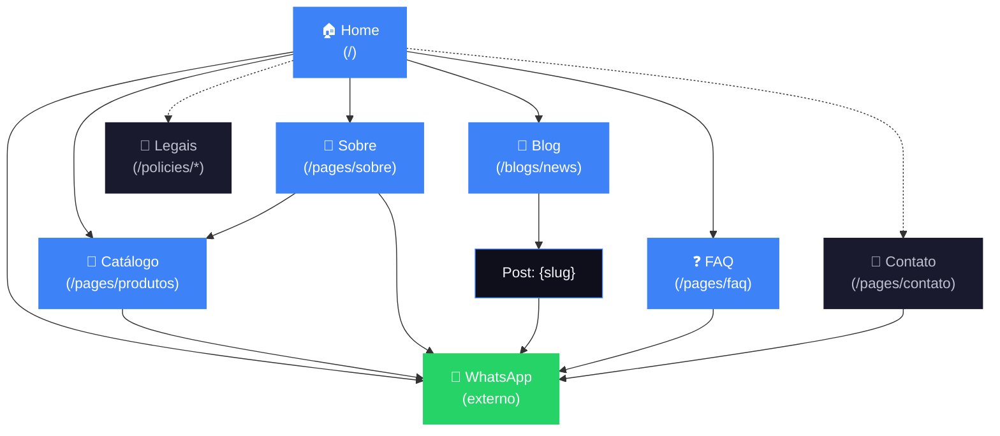

# Arquitetura da informação — smartbasebr.com

**Versão:** v2 final (aprovada 26/05/2026)
**Tipo:** Hybrid SMB — vitrine WhatsApp-funnel + blog/conteúdo + local business
**Pivotada estratégica:** home **institucional pura** (não tem grade de produtos); catálogo vive em página separada; trade-in descontinuado conforme escala nacional

---

## Premissas estratégicas

**Objetivos do site (ordem de prioridade):**
1. Iniciar conversa qualificada no WhatsApp
2. SEO local Caxias / Serra Gaúcha
3. SEO nacional pra keywords de confiança / educação
4. Construir autoridade digital a partir da credibilidade offline

**Constraints inegociáveis:**
- Funil 100% WhatsApp (Shopify sem checkout)
- Dark + azul acento + lowercase + Bricolage Grotesque/Inter
- Tom confiante, direto, sem hype
- Premissa-mestre do cliente: **as pessoas compram com os olhos** — site precisa ter imagens que gerem desejo
- v1: sem foto da loja, sem foto/nome do dono, sem CNPJ visível, sem depoimentos, sem reviews (deixar pra v2 quando tiver material)
- Linguagem de garantia **positiva** (lacrados + Apple 1 ano + 3 meses própria) — não defensiva (não comparar com paralelo/réplica)

---

## Personas (2)

**Persona 1 — Profissional Serra que já te conhece**
30-45, profissional liberal ou pequeno empresário (advogado, médico, contador, arquiteto, designer, consultor). Caxias e região. Apple é ferramenta de trabalho. Chega no site pelo boca-a-boca local ou Insta. Vem confirmar/pedir, não descobrir.

**Persona 2 — Cético nacional buscando confiança**
25-40, profissional/autônomo, qualquer cidade do Brasil. Pesquisou no Google "iphone seminovo confiável", "iphone importado garantia". Não conhece a Smartbase. Vai vasculhar antes de chamar — quer prova via conteúdo (blog, FAQ, garantia explicada). Só chama WhatsApp quando convencida.

---

## 9 blocos de conteúdo (locked)

| # | Bloco | Aparece em |
|---|---|---|
| 1 | Catálogo de produtos (grade visual, novos + seminovos) | Página `Catálogo` |
| 2 | CTA WhatsApp global (header sticky em toda página) | Todas |
| 3 | Mensagem WhatsApp pré-preenchida por produto | Catálogo |
| 4 | Endereço completo + horário (sem foto v1) | Sobre, Contato, Footer |
| 5 | Garantia positiva (lacrados + Apple 1 ano + 3 meses própria) | Sobre, FAQ, badge em produtos |
| 6 | Blog com foco SEO | Página `Blog` + posts |
| 7 | FAQ com schema FAQPage (com pergunta sobre trade-in → WhatsApp) | Página `FAQ` |
| 8 | Diferenciais explícitos (3-4 cards visuais) | Home, Sobre |
| 9 | História da Smartbase (texto que se sustenta sem foto do dono) | Sobre + trecho na home |
| 10 | OG image + title + meta otimizados | Layout (todas) |

---

## Sitemap — 7 templates de página

### Home (`/`)
**Função:** vender a marca, levar pro catálogo. Mais experiência que e-commerce.
**Blocos:**
- Hero grande com **imagem de desejo** (Apple lifestyle, ambiente premium) + tagline curta + sub
- Posicionamento (2-3 linhas da tese)
- Diferenciais (3-4 cards visuais, não texto pesado)
- Trecho da história (com link "saiba mais" pro Sobre)
- Faixa visual de produtos em formato editorial/lookbook (não grade) → leva pro catálogo
- CTA dominante: "Ver catálogo →" + WhatsApp persistente

### Catálogo (`/pages/produtos`)
**Função:** vitrine real, onde o cliente escolhe e dispara WhatsApp.
**Blocos:**
- Hero curto da categoria (imagem forte)
- Filtros (novos / seminovos)
- Grade de produtos com **imagens grandes e arejadas**
- Cada card: foto, nome, cor, armazenamento, status, CTA "Pedir no WhatsApp" pré-preenchido
- CTA final: "Não achou? Chama a gente →"

### Sobre (`/pages/sobre`)
**Função:** história + tese + garantia. O lugar onde a Persona 2 ganha confiança.
**Blocos:**
- Hero institucional (imagem ambiente, não pessoa)
- A história (texto sem foto do dono v1 — precisa se sustentar bem)
- A tese da marca expandida ("o Apple certo, não o mais caro")
- **Bloco de garantia** (lacrados + Apple 1 ano + 3 meses própria pros seminovos) — visualmente proeminente
- Endereço + "loja física em Caxias do Sul"
- CTA WhatsApp

### Blog (`/blogs/news`)
**Função:** SEO + conteúdo educacional pra Persona 2.
**Blocos:**
- Hero do blog
- Grade de posts com cover image
- Cada post → página própria

### Post de blog (`/blogs/news/{slug}`)
**Função:** leitura + conversão.
**Blocos:**
- Cover image grande
- Título, data, tempo de leitura
- Conteúdo
- CTA WhatsApp ao fim
- 2-3 posts relacionados

### FAQ (`/pages/faq`)
**Função:** desarmar dúvidas, capturar SEO de "como funciona X smartbase".
**Blocos:**
- Hero
- Perguntas agrupadas em categorias (garantia, entrega, pagamento, **trade-in com CTA WhatsApp**, originalidade)
- Schema `FAQPage` (rich snippet no Google)
- CTA "Ainda tem dúvida? WhatsApp →"

### Contato (`/pages/contato`)
**Função:** quem quer ir presencialmente ou ver onde fica.
**Blocos:**
- Endereço + horário
- Mapa Google embedado
- WhatsApp grande
- (Form opcional — v2)

### Legais (`/policies/privacy-policy`, `/policies/terms-of-service`)
Shopify gera. Só ajustar conteúdo. Linkados só do footer.

### 404
Já existe e está bem desenhada — mantém como está.

---

## Hierarquia (ASCII tree)

```
Home (/)
├── Catálogo (/pages/produtos)
├── Sobre (/pages/sobre)
├── Blog (/blogs/news)
│   └── Post (/blogs/news/{slug})
├── FAQ (/pages/faq)
├── Contato (/pages/contato)           [footer only]
└── Legais (/policies/*)                [footer only]
```

Estrutura plana, 2 níveis (L0/L1) — só posts vão pra L2.

---

## Navegação

### Header (5 itens + CTA)

```
[Logo smartbase]   Catálogo   Sobre   Blog   FAQ        [quero meu apple →]
```

- **Sem "Contato" no header** — o botão WhatsApp **é** o contato. A página `/contato` é mais "onde estamos" do que "fale com a gente".
- CTA WhatsApp sticky em toda página (sempre visível ao scroll).

### Footer (3 colunas + linha legal)

```
┌─────────────────────┬──────────────┬────────────────────┐
│ [Logo + tagline]    │ Navegar       │ Falar com a gente  │
│                     │ ─────────     │ ─────────          │
│ sua apple store     │ • Catálogo    │ • WhatsApp         │
│ particular          │ • Sobre       │ • Instagram        │
│                     │ • Blog        │ • Caxias do Sul    │
│                     │ • FAQ         │                    │
│                     │ • Contato     │                    │
└─────────────────────┴──────────────┴────────────────────┘
──────────────────────────────────────────────────────────────
© 2026 smartbase · atendemos todo o Brasil    [Privacidade] [Termos]
```

### Breadcrumbs

Implementar em todas as páginas exceto Home, com schema `BreadcrumbList`:

| URL | Breadcrumb |
|---|---|
| `/pages/produtos` | Home > Catálogo |
| `/blogs/news` | Home > Blog |
| `/blogs/news/vale-a-pena-seminovo` | Home > Blog > Vale a pena seminovo? |
| `/pages/sobre` | Home > Sobre |
| `/pages/faq` | Home > FAQ |
| `/pages/contato` | Home > Contato |

---

## Linking interno

### Princípio: tudo puxa pra WhatsApp ou pra Catálogo

Toda página tem caminho claro (≤1 clique) pro WhatsApp ou pro Catálogo (de onde vai pro WhatsApp).

### Links críticos página-a-página

| De | Pra | Como |
|---|---|---|
| Home | Catálogo | CTA dominante + faixa visual de produtos |
| Home | Sobre | "Saiba mais" no bloco história |
| Home | Blog | Seção "Conteúdo recente" (2-3 posts) |
| Catálogo | WhatsApp | Botão em cada card + CTA final |
| Sobre | WhatsApp | CTA pro WhatsApp |
| Sobre | Catálogo | CTA "Ver o que tem disponível →" |
| Sobre | FAQ | Link contextual no bloco garantia |
| Post de blog | WhatsApp | CTA fixo no fim |
| Post de blog | Catálogo | Link contextual quando tema permite |
| Post de blog | 2-3 posts relacionados | Bloco "Você também pode gostar" |
| FAQ | WhatsApp | CTA fixo + por categoria de pergunta |
| FAQ | Sobre/Garantia | Link contextual quando pergunta cobrir |
| Contato | WhatsApp | CTA grande |

### Hub-and-spoke do blog (quando tiver 6+ posts)

**Hub 1: "Guia completo: comprar iPhone com segurança no Brasil"** (pillar 2.500+ palavras)
Spokes:
- vale a pena iPhone seminovo
- iPhone importado é seguro (garantia internacional)
- iPhone com nota fiscal por que importa
- diferença entre seminovo, recondicionado, usado

**Hub 2: "Qual iPhone escolher em 2026"** (pillar comparativo)
Spokes:
- iPhone 17 vs 16
- iPhone Pro vs Air
- iPhone Pro Max vale a pena?

Cada spoke linka pro hub. Hub linka pra todos os spokes.

---

## URL map table

| Página | URL | Parent | Nav | Prioridade |
|---|---|---|---|---|
| Home | `/` | — | Logo (header) | Crítica |
| Catálogo | `/pages/produtos` | Home | Header | Crítica |
| Sobre | `/pages/sobre` | Home | Header | Alta |
| Blog | `/blogs/news` | Home | Header | Alta |
| Post de blog | `/blogs/news/{slug}` | Blog | Linkado de Blog/Home | Alta |
| FAQ | `/pages/faq` | Home | Header | Alta |
| Contato | `/pages/contato` | Home | Footer | Média |
| WhatsApp (externo) | `https://wa.me/55549...` | — | Header (botão) + toda página | Crítica |
| Privacidade | `/policies/privacy-policy` | — | Footer | Baixa |
| Termos | `/policies/terms-of-service` | — | Footer | Baixa |

---

## Visual sitemap (Mermaid)



Legenda: azul = header nav, escuro = footer only, verde = WhatsApp (externo), linhas pontilhadas = acesso via footer/contextual.

---

## Próximo passo: wireframes lo-fi no Figma

Com IA fechada, próxima etapa é **wireframes em baixa fidelidade** no Figma — caixa-e-linha-cinza, sem estética, só estrutura/hierarquia/ordem de blocos.

Por página, definir:
1. O que entra above-the-fold
2. Ordem dos blocos verticalmente
3. Hierarquia visual (peso de cada bloco)
4. Onde os CTAs dominantes ficam
5. Comportamento mobile (qual ordem em vertical)

Sequência sugerida (1 página por vez, validar antes da próxima):
1. **Home** (mais importante — define tom)
2. **Catálogo** (segunda mais visitada)
3. **Sobre** (define tom institucional)
4. **FAQ** (estrutura repetível)
5. **Blog + Post** (template pattern)
6. **Contato** (mais simples)
